# 📈 Stock Market Assistant

A chatbot that answers questions about US stocks — prices, history, news, dividends,
company info — by giving an LLM a set of tools that call a live market data API.
Built as a project for [DataTalksClub's LLM Zoomcamp](https://github.com/DataTalksClub/llm-zoomcamp).

## Why an agent instead of plain RAG

Most Q&A bots retrieve from a fixed set of documents. That doesn't work well for
stock prices, which change every second — there's no fixed corpus to index. So
instead of a static knowledge base, the LLM here gets a set of tools that hit the
[Massive Stock Market API](https://www.massive.com/stocks) directly, decides which
ones a question needs, and answers with the actual numbers it gets back.

There's still a small knowledge base for the more qualitative questions —
"what does this company do", "why is it in the news" — built by pulling company
overviews and recent news into Postgres ahead of time. Searching it is just one
more tool the agent can reach for.

## Architecture

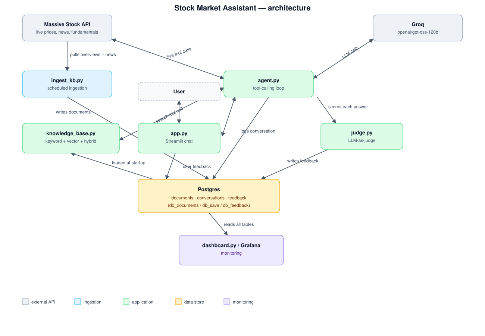

- The user asks a question in the Streamlit chat (`app.py`).
- The agent (`agent.py`) decides which tool(s) to call: live data tools
  (`tools.py` → `massive_client.py` → Massive API) for anything time-sensitive,
  or `search_company_knowledge_base` (hybrid keyword + vector search over
  `knowledge_base.py`) for qualitative questions.
- The knowledge base is built ahead of time by `ingest_kb.py`, which pulls
  company overviews and news into Postgres; `knowledge_base.py` loads it into
  memory at startup.
- Every answer is logged to Postgres, scored for relevance by an LLM judge
  (`judge.py`), and can be thumbs up/down'd by the user. A dashboard
  (`monitoring/dashboard.py`, or Grafana) reads the same tables.

## Tools

`massive_client.py` wraps the Massive REST API; these are the tools the agent
can call:

| Tool | Endpoint |
|---|---|
| `get_market_status` | `GET /v1/marketstatus/now` |
| `get_stock_snapshot` | `GET /v2/snapshot/locale/us/markets/stocks/tickers/{ticker}` |
| `get_previous_close` | `GET /v2/aggs/ticker/{ticker}/prev` |
| `get_price_history` | `GET /v2/aggs/ticker/{ticker}/range/{mult}/{span}/{from}/{to}` |
| `get_company_overview` | `GET /v3/reference/tickers/{ticker}` |
| `get_top_movers` | `GET /v2/snapshot/locale/us/markets/stocks/{gainers\|losers}` |
| `get_stock_news` | `GET /v2/reference/news` |
| `get_dividends` | `GET /stocks/v1/dividends` |
| `search_company_knowledge_base` | hybrid search over the ingested overviews + news |

<details>
<summary>Each tool in action (real conversations, click to expand)</summary>

**get_market_status** — "Is the U.S. stock market open right now?"
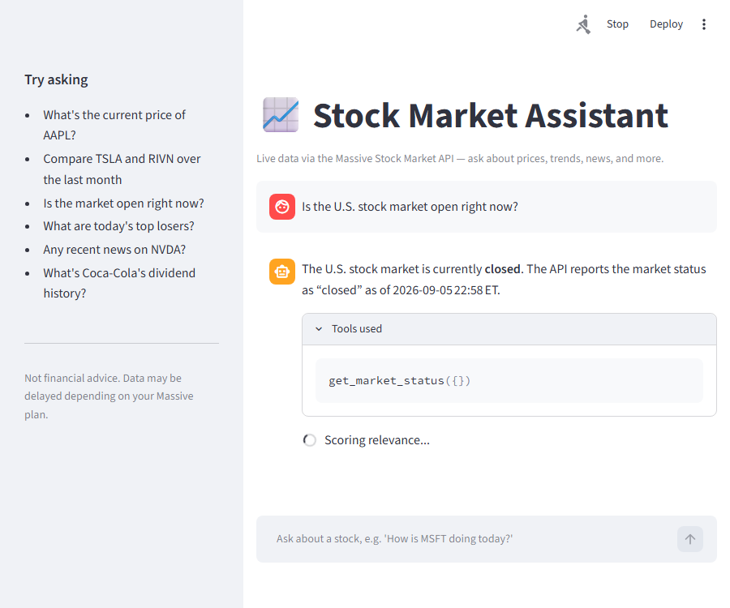

**get_stock_snapshot** — "What's Microsoft trading at right now, including today's range?"
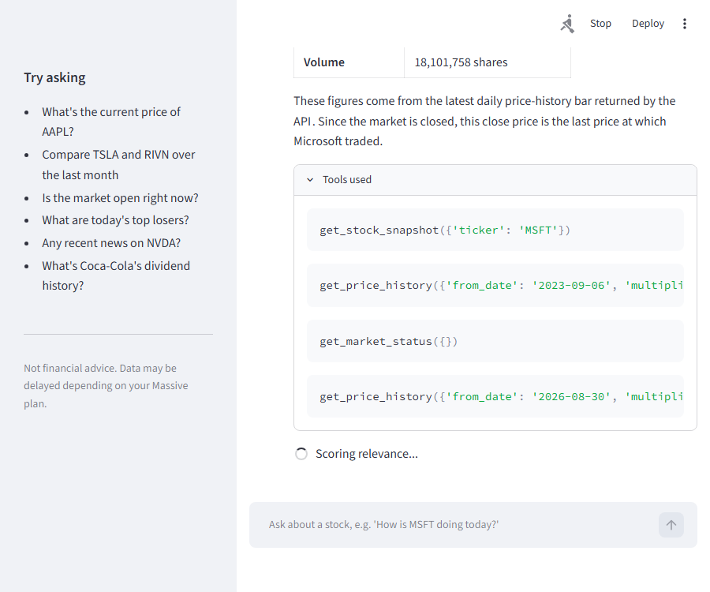

**get_previous_close** — "What was Tesla's open, high, low, close and volume yesterday?"
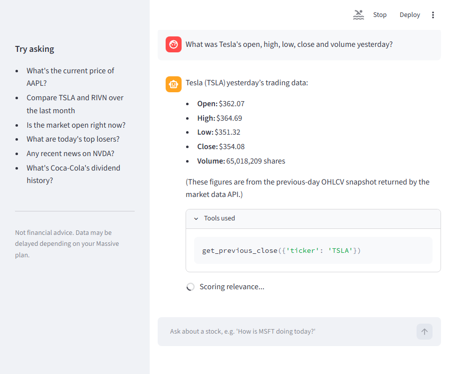

**get_price_history** — "Show me Apple's daily closing prices for the last 10 days."
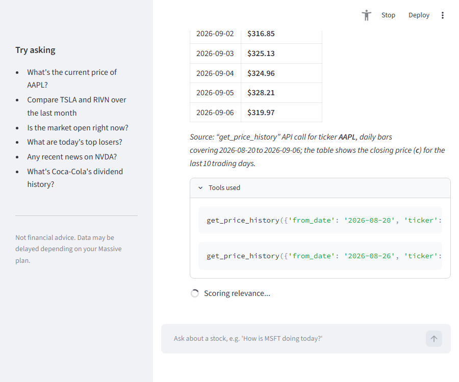

**get_company_overview** — "What exchange does Netflix trade on, and what's its market cap?"
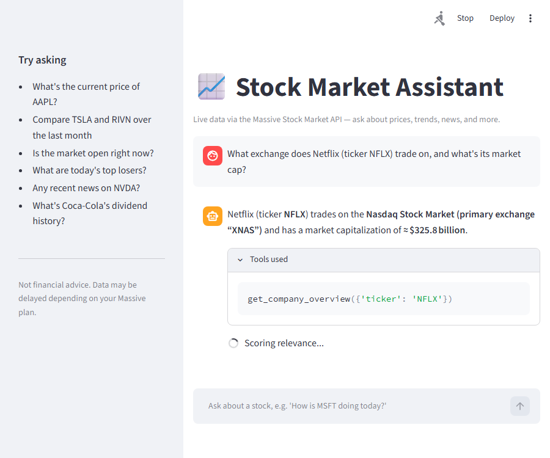

**get_top_movers** — "What are today's biggest gaining stocks?" (free plan doesn't include this
endpoint — the agent explains the limitation instead of guessing, and the judge correctly
flags the answer as not relevant)
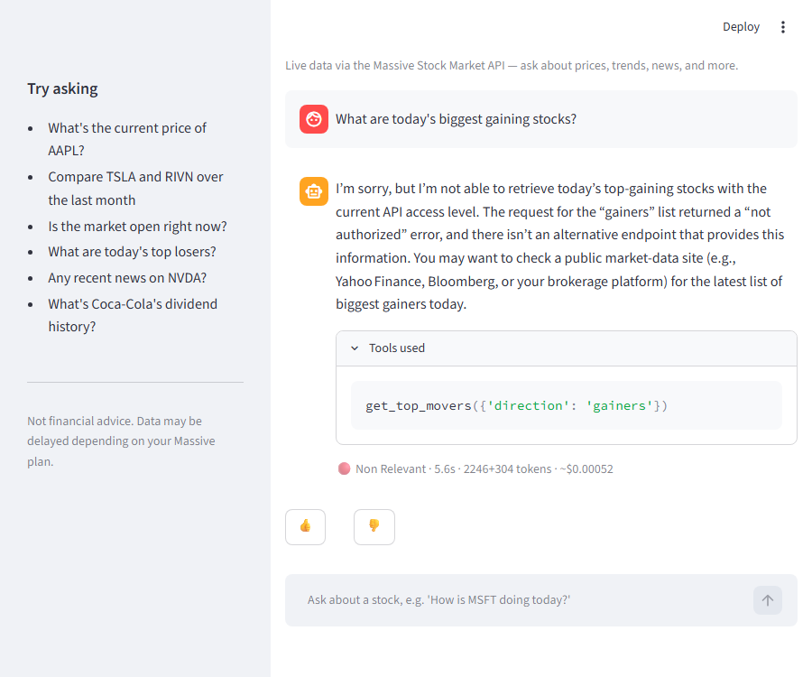

**get_stock_news** — "What's the latest news on Google?"
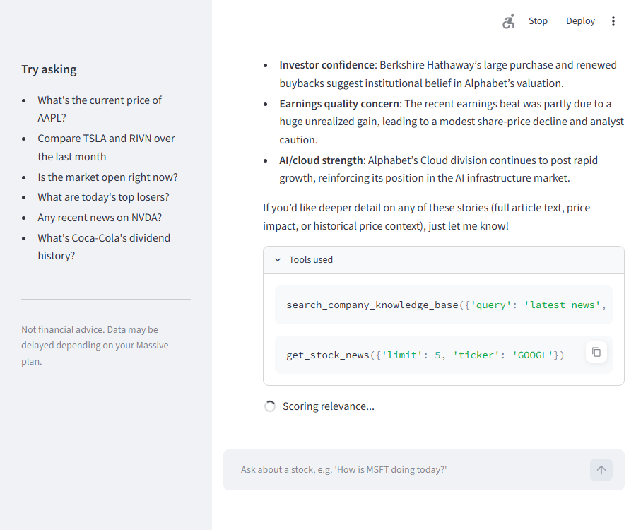

**get_dividends** — "What are IBM's most recent dividend payments?"
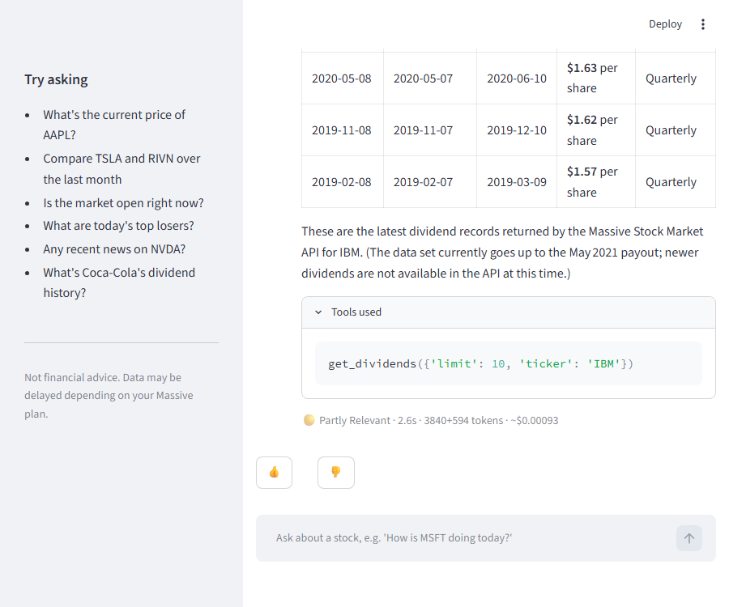

**search_company_knowledge_base** — "What does Coca-Cola do as a company, and why might it be
in the news?"
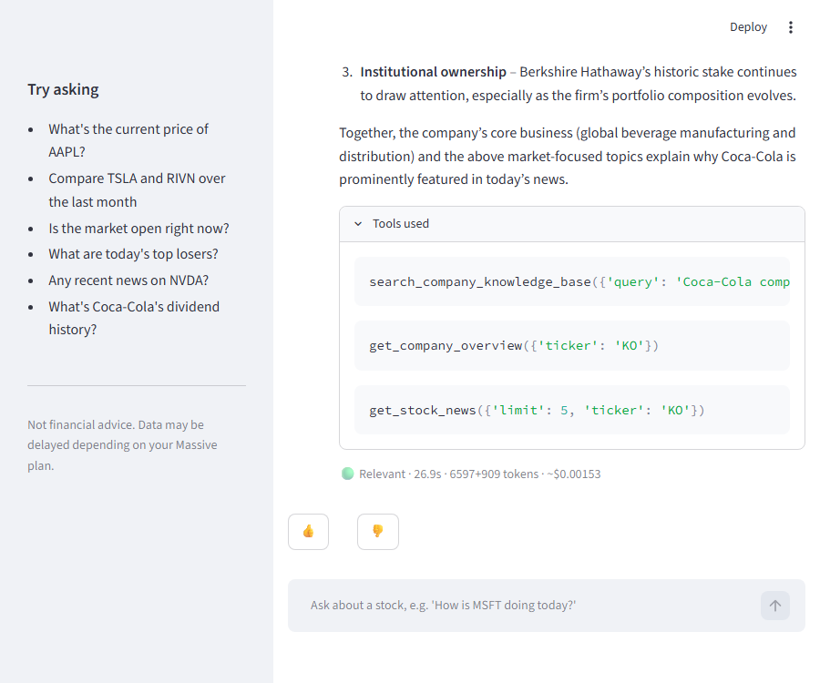

</details>

Get a free key at [massive.com/dashboard/signup](https://massive.com/dashboard/signup).
A few limits on the free plan are worth knowing about up front (see
[massive.com/pricing](https://massive.com/pricing)): **5 requests/minute**, **2 years
of history** (older date ranges 403), **end-of-day data, not live quotes**, and
`get_top_movers` needs a paid plan. `massive_client.py` retries rate-limited
requests with backoff, and the agent is told not to keep hammering a tool that's
failing for a plan reason — it explains the limitation instead.

## Tech stack

- **LLM** — [Groq](https://groq.com), `openai/gpt-oss-120b` by default. Set
  `MODEL_NAME` in `.env` to use a different one. Everything goes through OpenAI's
  Responses API, which Groq supports directly, so pointing
  `evaluation_utils.get_client()`'s `base_url` at OpenAI instead would work too.
- **Agent** — a plain function-calling loop, no framework (`agent.py`). There's
  also a [ToyAIKit](https://github.com/alexeygrigorev/toyaikit)-based version for
  notebook exploration (`notebooks/explore_agent.ipynb`).
- **Search** — [minsearch](https://github.com/alexeygrigorev/minsearch) for
  keyword search, an ONNX `all-MiniLM-L6-v2` embedder for vector search, combined
  with reciprocal rank fusion.
- **Storage** — Postgres, via `psycopg`.
- **Interface** — Streamlit.
- **Monitoring** — a built-in Streamlit dashboard, or Grafana against the same
  tables (`docker-compose.yaml`).
- **Evaluation** — LLM-generated ground truth, a tool-selection hit rate, a
  two-part LLM judge (answer quality + tool-call trajectory), and a separate
  keyword-vs-vector-vs-hybrid retrieval comparison. See `eval/`.

## Project layout

```
stock-chat-assistant/
├── massive_client.py          # Massive API wrapper
├── ingest_kb.py                # pulls overviews + news into the documents table
├── knowledge_base.py            # keyword + vector + hybrid (RRF) search
├── embedder.py                   # ONNX Runtime embedder
├── download_embedding_model.py    # one-time model download
├── db_documents.py                 # Postgres helpers for `documents`
├── tools.py                         # tool functions + JSON schemas for the LLM
├── agent.py                          # the agent loop + ToyAIKit runner
├── models.py                          # shared dataclasses (no API-client deps)
├── judge.py                           # relevance judge, run on every turn
├── evaluation_utils.py                 # shared LLM-call helpers
├── db_init.py                           # schema (conversations, feedback, documents)
├── db_save.py / db_feedback.py / db_query.py
├── app.py                                 # Streamlit chat
├── monitoring/dashboard.py                 # monitoring dashboard
├── eval/
│   ├── ground_truth.py                      # generates test questions
│   ├── evaluate.py                           # agent answer + trajectory eval
│   └── search_evaluation.py                   # retrieval comparison
├── notebooks/explore_agent.ipynb
├── tests/
├── data/watchlist.json                          # tickers to ingest
├── kestra/                                        # scheduled ingestion flow
├── docs/architecture.svg
├── Dockerfile / docker-compose.yaml / Makefile
└── .env.example
```

## Getting started

```bash
cp .env.example .env
# add GROQ_API_KEY and MASSIVE_API_KEY

uv sync
```

`uv sync` skips `jupyter` and `toyaikit` by default — they're only needed for the
notebook and live in a separate group. Run `uv sync --group notebook` if you want
to open `notebooks/explore_agent.ipynb`.

Download the embedding model (one-time, ~87MB):

```bash
make download-model
```

Start Postgres and build the knowledge base:

```bash
make postgres     # postgres:17 in Docker
make init-db      # creates the tables
make ingest       # pulls data for data/watchlist.json
```

`make ingest` upserts by document id, so re-running it to refresh the knowledge
base is safe. In production you'd schedule it instead of running it by hand —
see [Scheduling ingestion](#scheduling-ingestion) below.

Run the chat app:

```bash
make chat
```

Open http://localhost:8501 and try things like:

- "What's the current price of AAPL?"
- "Compare TSLA and RIVN over the last month"
- "Is the market open right now?"
- "Any recent news on NVDA?"
- "What's Coca-Cola's dividend history?"

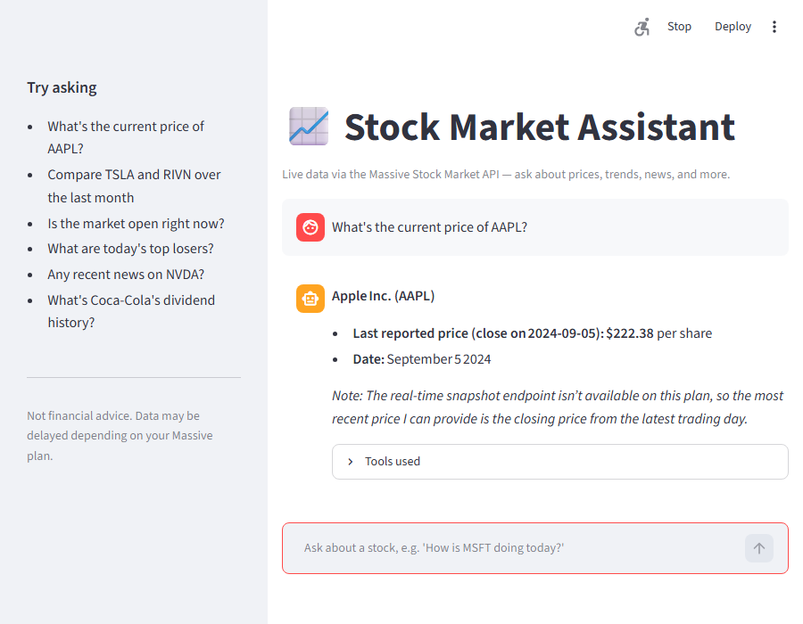

**"Any recent news on NVDA?"**
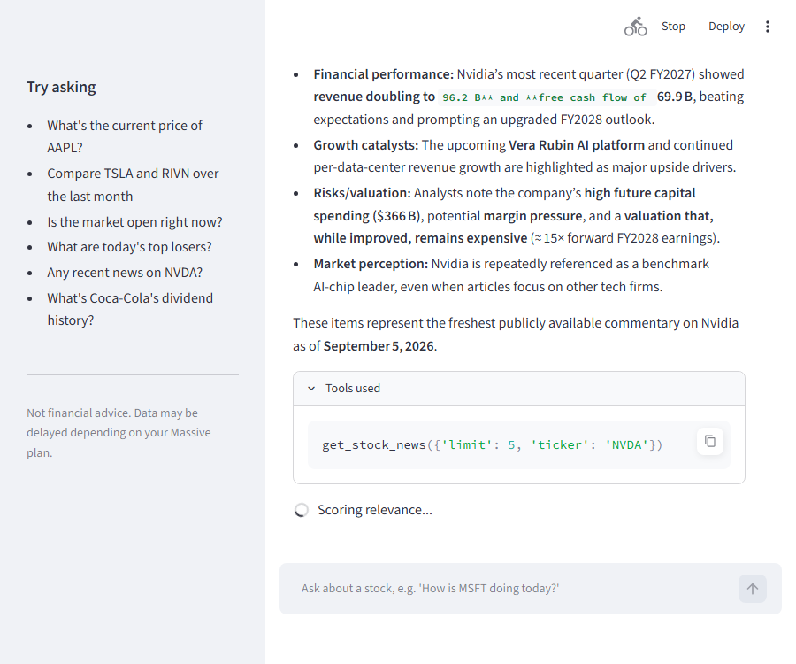

Every answer is logged, scored for relevance, and shown with which tools the
agent actually called (expand "Tools used" above). Right after the answer, a
judge LLM scores it — a brief "Scoring relevance..." spinner resolves into a
🟢/🟡/🔴 badge next to the response time, token count, and cost:


Or run the whole stack in Docker:

```bash
docker compose up --build
```

This gives you the chat app on `:8501`, the dashboard on `:8502`, and Grafana on
`:3000` (`admin`/`admin`) — point Grafana at the `postgres` service if you want
richer charts or alerting than the built-in dashboard.

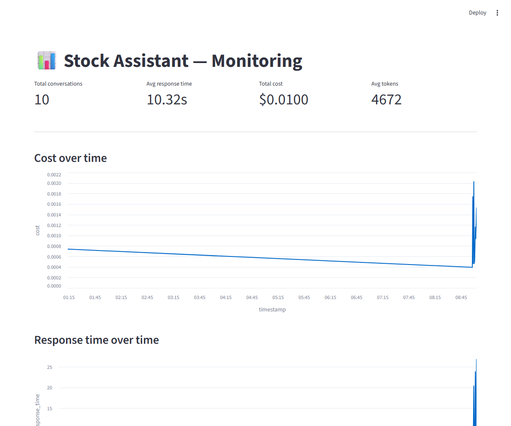

Other useful commands:

```bash
make test         # unit tests
make eval         # agent evaluation (tool hit rate, answer + trajectory scores)
make search-eval  # keyword vs. vector vs. hybrid retrieval comparison
```

## Scheduling ingestion

`kestra/` has a Kestra flow that runs `ingest_kb.py` on a schedule instead of by
hand — see `kestra/README.md` for setup. It hasn't been run against a live Kestra
instance, so treat it as a starting point rather than a tested recipe. A cron job
or a scheduled GitHub Actions workflow calling `uv run python ingest_kb.py` gets
you the same result with a lot less moving parts.

## Evaluation

**Retrieval** (`make search-eval`, comparing keyword/vector/hybrid over the
ingested watchlist data): vector search came out on top, Hit Rate 1.00 / MRR 0.92,
ahead of hybrid (1.00 / 0.87) and keyword (0.97 / 0.80).

**Agent** (`make eval`, an LLM judges each answer on quality and tool-call
trajectory): 100% tool-selection hit rate (8/8), 75% good on both answer and
trajectory scores. The lower scores trace back to real Massive free-plan limits —
a price history request further back than 2 years, and `get_top_movers` needing a
paid plan — rather than app bugs, plus one case of the agent making a redundant
duplicate tool call.

Both API providers' free tiers are easy to run into during evaluation: Groq's
free tier caps output at 8,000 tokens/minute *shared across all concurrent
requests*, and 200,000 tokens/day; Massive caps at 5 requests/minute. Tool
responses are trimmed to the fields a question actually needs (`tools.py`'s
`_compact_bars` / `_compact_news`), and both clients pace themselves
proactively instead of just reacting after the fact: `massive_client.py`
tracks a sliding window of the last 5 calls and only pauses once a 6th
would land within 60 seconds of the oldest one (so a normal 2-4-call turn
never waits at all), and `evaluation_utils.py` reads Groq's own
`x-ratelimit-remaining-tokens` header on every response and pre-emptively
sleeps out the window if it's running low. The one thing neither can do
anything about is Groq's *daily* cap — once that's actually exhausted,
`responses_create_retry` detects it and fails fast with a clear error
instead of burning ~105s cycling through retries that can't possibly
succeed for another ~15 minutes.

## What's implemented

- A knowledge base built from real ingested data, not just live API pass-through —
  the agent picks between the two depending on the question.
- Retrieval evaluation comparing keyword, vector, and hybrid search.
- Agent evaluation judging both the final answer and the tool calls that produced
  it (currently one model/prompt — no comparison across models yet).
- A Streamlit chat interface.
- An ingestion pipeline (`ingest_kb.py`) with an optional Kestra flow for running
  it on a schedule.
- Feedback logging (automatic + user thumbs up/down) and a monitoring dashboard.
- Full containerization — one `docker-compose.yaml` for the whole stack.
- Hybrid search, evaluated — no reranking or query rewriting yet.

Not done yet: comparing multiple models/prompts, and a cloud deployment.

## Limitations

- Both APIs' free tiers have real constraints — Massive's rate limit and 2-year
  history window, Groq's shared per-minute and per-day token caps. This isn't
  built for scale, it's built to run on free tiers without falling over.
- This is factual market data, not investment advice, and the system prompt says
  so explicitly.
- Free-tier rate limits mean the agent sometimes falls back to older or delayed
  data instead of the live number a question asked for — it says so when that
  happens rather than guessing.
